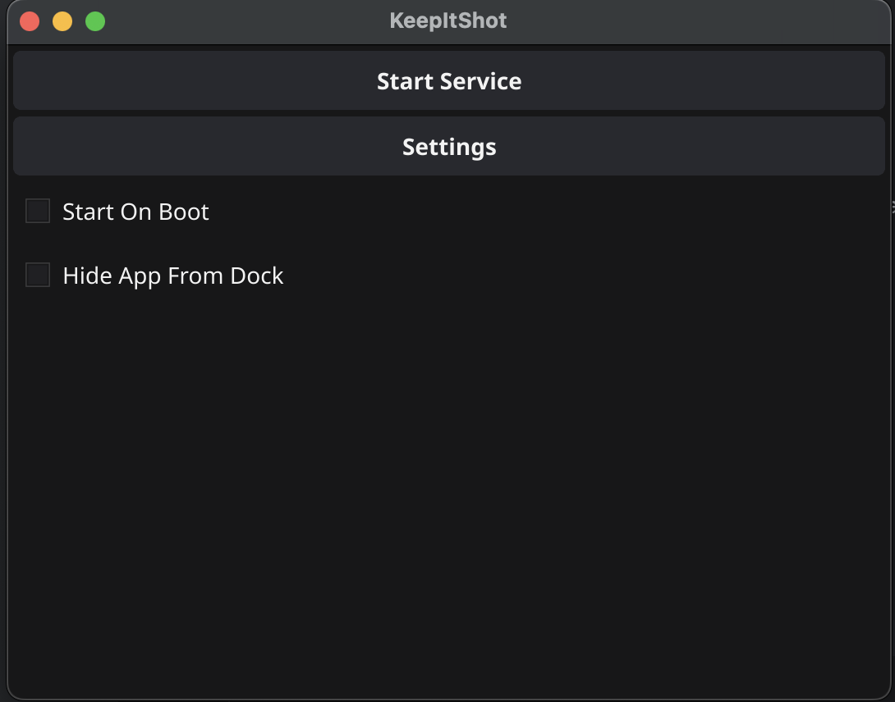
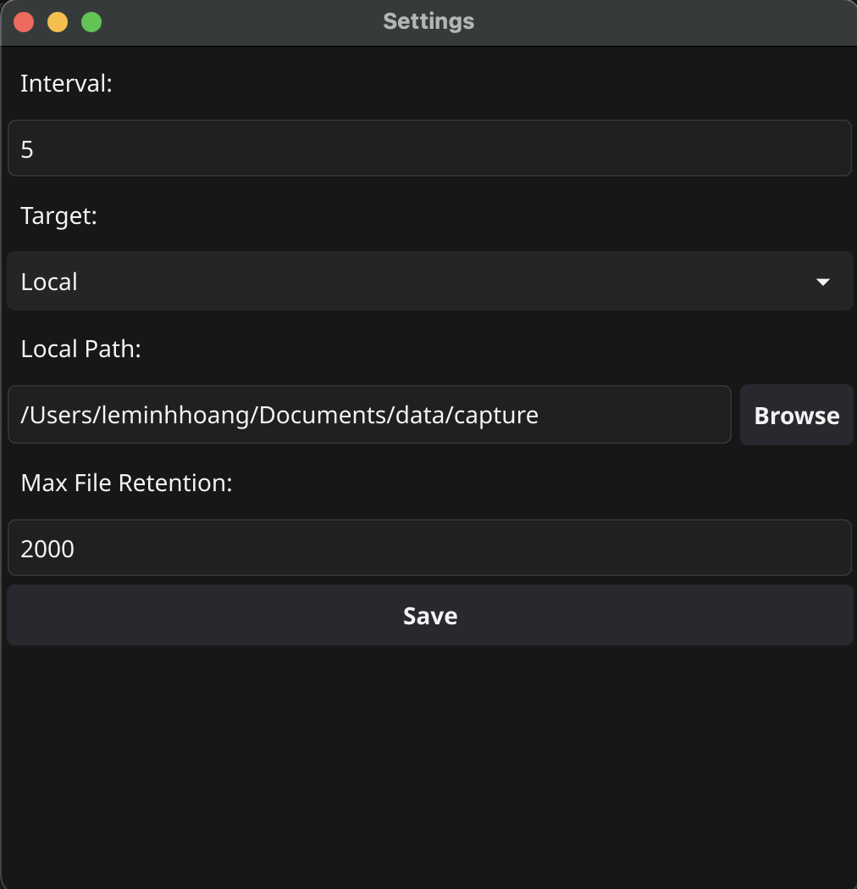
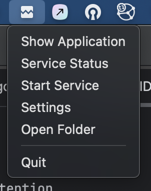

# Keep it Shot

# Description
This is a small utilities to automatically take screenshots of all your screen and save them in a folder after a certain time interval. Sometimes, you need to take screenshots of all your screens to keep track of what you are doing or keep the evidence of what happened. This application will help you do that.

# Features and Roadmap
* Take screenshots of all your screens
* Multiple target folder
    * [x] Local: Save screenshots in a local folder on your computer
    * [ ] HTTP: Save screenshots in a folder on a remote server via HTTP
    * [ ] S3: Save screenshots in a folder on a remote server via S3
* Settings
    * [x] Interval: Set the time interval between each screenshot
    * [x] Folder: Set the folder where the screenshots will be saved
    * [ ] Filename: Set the filename of the screenshots
    * [ ] Quality: Set the quality of the screenshots
    * [ ] Format: Set the format of the screenshots
    * [ ] Resolution: Set the resolution of the screenshots
    * [ ] Screens: Set the screens to take screenshots from
    * [x] HTTP: Endpoint
    * [x] S3 Info
        * [x] Access Key
        * [x] Secret Key
        * [x] Bucket Name
        * [ ] Region
        * [ ] Path
        * [x] Endpoint
    * [x] Local file retention
* Tray icon
    * [x] Start/Stop the service
    * [x] Open the settings
    * [x] Open the folder
    * [x] Quit the application
* [ ] Bring your own backend model
* [x] Hide the application to the tray
* [ ] Add a way to start the application on startup

# Bring your own backend model
In the future, I will add a way to bring your own backend model. This will allow you to create your own backend model and use it in the application.

# Screenshots

# How to use
1. Download the latest release
2. Run the application
3. Set the settings
4. Start the service
5. Enjoy

# How to build
1. Clone the repository
2. cd into the repository
3. Run `go build -o keep-it-shot keepitshot`

# License
This project is licensed under the MIT License - see the LICENSE file for details
